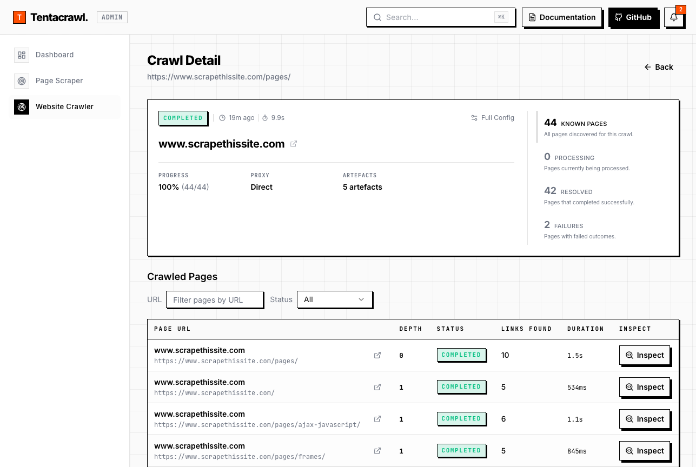

# Tentacrawl

Tentacrawl turns modern, browser-rendered websites into clean, reusable data for automation, search, analytics, and AI pipelines. Run it on your own infrastructure for full control, or use it behind a managed browser fleet when execution is the hard part.

It is built for teams that need to capture content from dynamic websites, monitor changes over time, and move that data into internal tools, knowledge bases, and LLM workflows.

The platform exports browser runs into reusable artefacts, including:

- Markdown for LLM-ready content ingestion and knowledge workflows
- JSON for downstream systems, APIs, ETL, and structured processing
- HTML snapshots for raw page capture and auditability
- metadata records for titles, links, timestamps, status, and execution context
- screenshots for visual verification and debugging
- discovered links for site exploration, crawling, and follow-up extraction



## Architecture

The runtime is organized into three applications:

- `apps/api`: NestJS HTTP API for configuration, job creation, admin endpoints, health, and metrics
- `apps/worker`: NestJS worker process that consumes BullMQ jobs and executes scraping or crawling runs
- `apps/web`: Next.js 15 admin UI for dashboard, scrape jobs, crawl jobs, and notifications

At a high level:

```text
apps/web (admin ui)
  |
  v
apps/api (http api) <----------> MongoDB (config, runs, artefact metadata)
  |
  v
BullMQ / Redis (job queue)
  |
  v
apps/worker (job execution)
  |
  v
packages/browser + Playwright
  |
  v
target websites -> extracted artefacts
```

The main architectural advantage is modularity. Tentacrawl is designed so users can enable only the capabilities they need, extend the platform without rewriting the core runtime, and keep feature-specific logic isolated from the shared scraping, crawling, browser, and infrastructure layers.

Each feature module lives in its own package and plugs into the platform through explicit metadata, shared schemas, and generated registries. A module can contribute several surfaces at once:

- API endpoints for configuration and operations
- worker services and subscribers for queue-driven execution
- frontend pages, components, and hooks for the admin UI
- data entities and schemas that define its runtime contract

In practice, each module is a self-contained package under `packages/<module>` with its own metadata, schemas, runtime logic, and optional frontend surface. The workspace generator assembles enabled modules into the API, worker, and web applications from `modules.config.ts`, which keeps the system extensible without turning the monorepo into a patchwork of hard-coded feature switches.

## Current Modules

Enabled modules are declared in `modules.config.ts` and currently include:

| Module | Purpose | UI Surface |
| --- | --- | --- |
| `admin` | dashboard, worker presence, operational activity tracking | `/dashboard` |
| `captchaai` | CaptchaAI challenger extension: detects captchas and solves reCAPTCHA v2/v3/Enterprise, Turnstile, and image captchas | extensions dashboard |
| `challenger` | extension framework host: dispatch, signals, and the extensions admin dashboard | `/extensions` |
| `crawler` | multi-page crawling with depth, breadth, and URL filtering controls | `/crawl/*` |
| `notification` | lifecycle notifications for scrape, crawl, and future module events | notification center |
| `proxy` | manually defined proxy servers with endpoint rotation and usage tracking; reference challenger extension | full module |
| `scraper` | single-page scraping with configurable artefact formats | `/scrape/*` |

Foundational packages used by those modules:

- `packages/browser`: hardened Playwright context creation, artefact collection, link discovery
- `packages/cli`: module registry generator
- `packages/core`: shared schemas, config validation, module metadata, extension registry
- `packages/dsl`: YAML DSL parsing, validation, and compilation
- `packages/ui`: shared React components, layout, data and form helpers

## Repository Layout

```text
apps/
  api/       NestJS API app
  worker/    NestJS worker app
  web/       Next.js admin app

packages/
  admin/         dashboard and worker presence module
  browser/       Playwright runtime helpers
  captchaai/     CaptchaAI captcha detection and solving module
  challenger/    challenger extension framework host (dispatch, signals, admin)
  cli/           generated module registry builder
  core/          shared contracts, schemas, config, extension hooks
  crawler/       recursive crawl module
  dsl/           YAML DSL compiler and validation
  notification/  notification module
  proxy/         proxy management module
  scraper/       single-page scrape module
  ui/            shared frontend library
```

## Generated Code

The monorepo uses committed generated registries. Do not edit generated files by hand.

- source of truth: `modules.config.ts`
- generator: `pnpm generate`
- generated outputs:
  - `apps/api/src/generated/modules.ts`
  - `apps/worker/src/generated/modules.ts`
  - `apps/web/src/generated/navigation.ts`
  - `apps/web/src/generated/routes.ts`

Run `pnpm generate` whenever you add, remove, or rename enabled modules, or when module metadata changes.

## Prerequisites

- Node.js 22+
- pnpm 9+
- MongoDB
- Redis
- Playwright browser binaries

## Installation

```bash
pnpm install
pnpm exec playwright install chromium
pnpm generate
pnpm build
```

## Configuration

Runtime configuration is validated with Zod from `packages/core/src/config.schema.ts`.

### API

Create `apps/api/.env.local` locally with values such as:

```dotenv
NODE_ENV=development
PORT=3000
LOG_LEVEL=info
MONGO_URI=mongodb://localhost:27017
MONGO_DB_NAME=tentacrawl
REDIS_HOST=localhost
REDIS_PORT=6379
CORS_ORIGIN=http://localhost:3001,http://127.0.0.1:3001
```

### Worker

Create `apps/worker/.env.local` locally with values such as:

```dotenv
NODE_ENV=development
PORT=3002
LOG_LEVEL=info
MONGO_URI=mongodb://localhost:27017
MONGO_DB_NAME=tentacrawl
REDIS_HOST=localhost
REDIS_PORT=6379
```

The worker defaults to port `3002` so it does not clash with the web app on `3001`.

### Web

Optional local override:

```dotenv
NEXT_PUBLIC_API_URL=http://localhost:3000
```

If not set, the web app defaults to `http://localhost:3000` for API calls.

### Optional tuning

These have safe defaults and are only needed to tune runtime behavior:

```dotenv
# Worker: browser process pool cap (distinct launch profiles)
BROWSER_POOL_MAX=4

# Worker: how long the challenger dispatcher caches extension config/enable
# flags before re-reading them (0 disables caching for strictly live toggles)
CHALLENGER_CONFIG_CACHE_TTL_MS=3000

# Worker: comma-separated allowlist of challenger capabilities (unset = all)
CHALLENGER_ALLOWED_CAPABILITIES=proxy,session,fingerprint
```

The `captchaai` module needs an account key before it can solve anything. Without
it the module stays inert and only reports the captchas it detects:

```dotenv
# API and worker: CaptchaAI account key
CAPTCHAAI_API_KEY=...

# Optional CaptchaAI tuning
CAPTCHAAI_BASE_URL=https://ocr.captchaai.com
CAPTCHAAI_POLL_INTERVAL_MS=5000
CAPTCHAAI_TIMEOUT_MS=120000
```

Logs are emitted as structured JSON via `pino`. The API tags each request with a
correlation id (`x-correlation-id`, generated when absent and echoed back).

## Local Development

The quickest local path is one command:

```bash
pnpm dev
```

That command:

- starts MongoDB and Redis via Docker Compose
- runs the API on `http://localhost:3000`
- runs the worker on `http://localhost:3002`
- runs the web app on `http://localhost:3001`
- prefixes logs so the three app streams stay readable in one terminal

If MongoDB and Redis are already running, start only the apps:

```bash
pnpm dev:apps
```

If you want to manage only the local dependencies:

```bash
pnpm dev:deps
pnpm dev:deps:down
```

The default `docker-compose.yml` is intentionally limited to MongoDB and Redis.
That keeps the common local workflow simple and avoids accidentally booting the full app stack when you only need infrastructure.

Default local URLs:

- API: `http://localhost:3000`
- Web: `http://localhost:3001`
- Worker health: `http://localhost:3002/health`

Both the API and worker expose `/health` (readiness: verifies Mongo and Redis,
returns 503 when either is down), `/health/ready` (same readiness check), and
`/health/live` (liveness only, dependency-free).

The web app redirects `/` to `/dashboard`.

## Docker

There are two Docker scenarios:

1. Dependencies only, for local app development:

```bash
pnpm dev:deps
pnpm dev:deps:logs
pnpm dev:deps:down
```

2. Full stack in containers:

```bash
pnpm docker:up
pnpm docker:logs
pnpm docker:down
```

The full-stack profile uses `docker-compose.fullapp.yml` and starts:

- MongoDB on `localhost:27017`
- Redis on `localhost:6379`
- API on `http://localhost:3000`
- Worker on `http://localhost:3002`
- Web on `http://localhost:3001`

Useful overrides:

```bash
API_PORT=4000 WEB_PORT=4001 WORKER_PORT=4002 pnpm docker:up
MONGO_PORT=37017 REDIS_PORT=36379 pnpm dev:deps
NEXT_PUBLIC_API_URL=http://localhost:4000 pnpm docker:up
```

To reset Docker data completely:

```bash
docker compose down -v
docker compose -f docker-compose.fullapp.yml down -v
```

## Command Matrix

| Command | Scope | Purpose |
| --- | --- | --- |
| `pnpm dev` | local | start MongoDB, Redis, API, worker, and web |
| `pnpm dev:apps` | local | start API, worker, and web without Docker dependencies |
| `pnpm dev:api` | local | start only the API through the shared launcher |
| `pnpm dev:web` | local | start only the web app through the shared launcher |
| `pnpm dev:worker` | local | start only the worker through the shared launcher |
| `pnpm dev:deps` | local | start only MongoDB and Redis |
| `pnpm dev:deps:logs` | local | tail MongoDB and Redis logs |
| `pnpm dev:deps:down` | local | stop MongoDB and Redis |
| `pnpm generate` | workspace | regenerate committed module registries |
| `pnpm lint` | workspace | run ESLint across all packages and apps |
| `pnpm test` | workspace | run workspace tests |
| `pnpm build` | workspace | build the full workspace |
| `pnpm clean` | workspace | clean package build output |
| `pnpm docker:up` | docker | build and start the full stack in containers |
| `pnpm docker:ps` | docker | show full-stack container status |
| `pnpm docker:logs` | docker | tail full-stack container logs |
| `pnpm docker:down` | docker | stop the full stack |
| `pnpm sandbox` | tooling | run the Playwright sandbox |

Per-app commands:

```bash
pnpm --filter @tentacrawl/api run start:prod
pnpm --filter @tentacrawl/worker run start:prod
pnpm --filter @tentacrawl/web run build
pnpm --filter @tentacrawl/web run start
```

## Testing

Unit and integration tests use Jest:

```bash
pnpm test
pnpm --filter @tentacrawl/browser run test
pnpm --filter @tentacrawl/scraper run test
pnpm --filter @tentacrawl/crawler run test
```

Playwright tests live under `.github/e2e`:

```bash
npx playwright test
npx playwright test .github/e2e/seed.spec.ts
```

Playwright uses `playwright.config.ts` at the repository root. The default base URL is `http://localhost:3000` unless `BASE_URL` is set.

## Browser Sandbox

The browser package includes a headed sandbox for iterating on DSL behavior and browser execution:

```bash
pnpm sandbox
pnpm sandbox packages/browser/sandbox/fixtures/example-scrape.yaml
```

## License

This project is licensed under the MIT License. See the [LICENSE](LICENSE) file for details.
